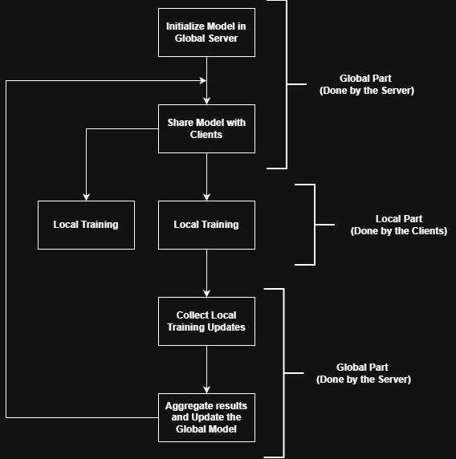

# Federated Learning (FL)

## A basic implementation of FL to demonstrate how it works

Federated Learning is a multi-client distributed learning paradigm. The main purpose of FL is to improve a global model through the local training of multiple clients.
The primary components required in FL are a global server and edge devices (clients).

## Workflow:

* Global server initiates a global model
* Shares the global model with clients
* Each client trains the global model locally on their local data. The local trainings happen in parallel.
* After completing local training, clients send their training results individually to the server.
* The server aggregates the local training results and updates the global model. This updated global model is shared again to begin the next epoch of training.

## How to run this code

2 ways to run:

* upload and run the .ipynd version directly at Colab/kaggle or any other notebook. The .ipynd file is in the ipynb_version folder.
* Download the clients.py and server.py files and run the code locally. Run clients.py file to begin the run.
